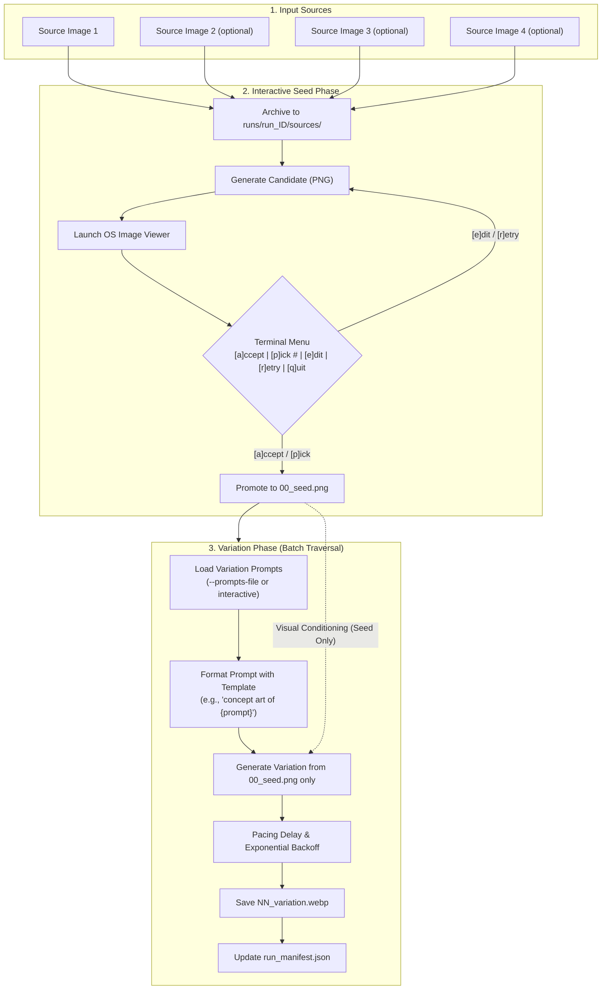

# Bulk Image Creator (`bulkimagecreator`)

> A robust, resilient command-line tool that blends 1 to 4 reference images into a curated **Seed Image** via an interactive review loop, then traverses a list of variation prompts to generate batches of stylized **Variation Images** using Google GenAI's image generation model (`gemini-3.1-flash-lite-image`).

---

## Table of Contents

- [Overview](#overview)
- [Key Features](#key-features)
- [Two-Phase Architecture](#two-phase-architecture)
- [Prerequisites & Installation](#prerequisites--installation)
- [Configuration](#configuration)
- [CLI Reference](#cli-reference)
  - [`bulkimagecreator run`](#bulkimagecreator-run)
  - [`bulkimagecreator resume`](#bulkimagecreator-resume)
- [Output Directory Structure](#output-directory-structure)
- [Run Manifest Schema](#run-manifest-schema)
- [Step-by-Step Walkthrough Examples](#step-by-step-walkthrough-examples)
  - [Example 1: Quickstart with a Single Image](#example-1-quickstart-with-a-single-image)
  - [Example 2: Multi-Source Blending & Custom Aspect Ratio](#example-2-multi-source-blending--custom-aspect-ratio)
  - [Example 3: Batch Production with Prompts File & Templates](#example-3-batch-production-with-prompts-file--templates)
  - [Example 4: Resuming an Interrupted Batch](#example-4-resuming-an-interrupted-batch)
- [Developer & Contributor Guide](#developer--contributor-guide)
  - [Architecture & Testing Seams](#architecture--testing-seams)
  - [Running the Test Suite](#running-the-test-suite)
- [License](#license)

---

## Overview

Generating consistent image variations using multimodal AI models can be unpredictable when feeding multiple original sources repeatedly into every variation prompt. 

`bulkimagecreator` solves this by introducing a clean, two-phase pipeline:
1. **Interactive Seed Phase**: Combines 1 to 4 source images with an initial seed prompt. You iterate interactively—inspecting candidate images in your operating system's image viewer—until you find the perfect output. This winning candidate is promoted to your definitive **Seed Image** (`00_seed.png`).
2. **Variation Phase (Batch Traversal)**: Feeds **strictly the Seed Image** (in accordance with [ADR 0001](docs/adr/0001-seed-only-variation-lineage.md)) alongside a sequence of variation prompts (loaded from a file or entered interactively) to produce a batch of cohesive, sequentially numbered images (`01_variation.webp`, `02_variation.webp`, ...).

---

## Key Features

- **Interactive Human-in-the-Loop Seed Phase**:
  - Live OS viewer integration: Automatically launches macOS Preview (`open`) or OS viewer upon candidate generation.
  - Interactive terminal menu:
    - `[a]ccept current`: Accept the latest candidate and promote it as the seed image.
    - `[p]ick candidate #`: Revisit and promote any previously generated candidate (e.g. candidate #1).
    - `[e]dit prompt`: Refine your prompt and generate candidate #2, #3, etc.
    - `[r]etry`: Re-run generation with the same prompt to get a different sample.
    - `[q]uit`: Cleanly exit without losing candidate history.
- **Multimodal Lineage Isolation ([ADR 0001](docs/adr/0001-seed-only-variation-lineage.md))**:
  - The Variation Phase conditions exclusively on `00_seed.png`, preventing visual drift and drastically reducing multimodal token consumption.
- **Dual Format Strategy ([ADR 0002](docs/adr/0002-dual-image-format-png-seed-webp-variations.md))**:
  - **Lossless PNG** for candidate and seed images (`00_seed.png`) to preserve maximum fidelity.
  - **Optimized WebP** for variation outputs (`NN_variation.webp`) to save disk space and enable high-volume batch generation.
- **Fault-Tolerant Batch Resilience**:
  - **Inter-Request Rate Pacing**: Configurable delay (default: `1.5s`) between requests to avoid burst rate limits.
  - **Exponential Backoff**: Automatic retry for transient errors (HTTP 429 Too Many Requests, HTTP 503 Service Unavailable, network timeouts) up to 2 retries.
  - **Fault Skipping**: Permanent safety blocks or policy refusals are logged and skipped cleanly, ensuring batch processing never crashes mid-run.
- **Crash Recovery & Interruption Resumption**:
  - Every candidate, prompt, status, and error is recorded atomically to `run_manifest.json`.
  - The `bulkimagecreator resume <run_dir>` command detects incomplete runs, skips already generated variations, retries transient failures, and finishes remaining prompts.

---

## Two-Phase Architecture



---

## Prerequisites & Installation

### Requirements
- **Python**: 3.10, 3.11, 3.12, 3.13, or 3.14
- **Operating System**: macOS (native viewer support via `open`), Linux, or Windows
- **API Key**: A valid [Google Gemini API Key](https://aistudio.google.com/)

### Installation

1. **Clone the repository**:
   ```bash
   git clone https://github.com/manuelhe/bulkimagecreator.git
   cd bulkimagecreator
   ```

2. **Create and activate a virtual environment**:
   ```bash
   python3 -m venv .venv
   source .venv/bin/activate
   ```

3. **Install the package in editable mode**:
   ```bash
   pip install -e .
   ```

   *(Optional)* To install test dependencies as well:
   ```bash
   pip install -e ".[test]"
   ```

---

## Configuration

Set your Gemini API key in your environment or in a local `.env` file in the root directory:

```bash
# Option A: Export directly in your shell
export GEMINI_API_KEY="your-gemini-api-key-here"

# Option B: Create a .env file (automatically loaded)
echo 'GEMINI_API_KEY="your-gemini-api-key-here"' > .env
```

---

## CLI Reference

### `bulkimagecreator run`

Initializes a new run with 1 to 4 source images, guides you through the interactive Seed Phase, and executes the Variation Phase.

```bash
bulkimagecreator run [OPTIONS] SOURCE_IMAGES...
```

#### Arguments
- `SOURCE_IMAGES...`: Between 1 and 4 file paths to existing, readable image files (`.png`, `.jpg`, `.jpeg`, `.webp`).

#### Options
| Option | Short | Type | Default | Description |
| :--- | :--- | :--- | :--- | :--- |
| `--prompt` | `-p` | `TEXT` | `None` | Initial prompt for the seed phase. If omitted, prompts interactively. |
| `--prompts-file` | `-f` | `PATH` | `None` | File containing variation prompts (one per line). Lines starting with `#` and blank lines are ignored. |
| `--prompt-template` | `-t` | `TEXT` | `"{prompt}"` | Template wrapping each variation prompt. Must include the `{prompt}` placeholder. |
| `--aspect-ratio` | `-a` | `CHOICE` | `1:1` | Target aspect ratio (`1:1`, `3:4`, `4:3`, `9:16`, `16:9`). |
| `--delay` | `-d` | `FLOAT` | `1.5` | Pacing delay in seconds between consecutive variation requests. |
| `--output-dir` | `-o` | `PATH` | `./runs` | Base directory where timestamped run folders are created. |
| `--model` | `-m` | `TEXT` | `gemini-3.1-flash-lite-image` | Target Gemini image generation model identifier. |
| `--no-open` | | `FLAG` | `False` | Disables automatically opening candidate images in the OS image viewer. |

---

### `bulkimagecreator resume`

Resumes an interrupted or partially completed run from its run directory.

```bash
bulkimagecreator resume [OPTIONS] RUN_DIR
```

#### Arguments
- `RUN_DIR`: Path to an existing run directory (e.g. `runs/run_20260921_183000`).

#### Options
| Option | Short | Type | Default | Description |
| :--- | :--- | :--- | :--- | :--- |
| `--delay` | `-d` | `FLOAT` | `1.5` | Pacing delay in seconds between requests (overrides manifest default). |
| `--prompts-file` | `-f` | `PATH` | `None` | Optional variation prompts file to reconcile or append to the run. |

---

## Output Directory Structure

Each execution creates a self-contained, timestamped run directory under `./runs/` (or your `--output-dir`):

```
runs/run_20260921_183000/
├── sources/                     # Pristine copies of input source images
│   ├── char_front.png
│   └── char_side.png
├── candidates/                  # All seed phase attempts (Lossless PNG)
│   ├── candidate_01.png
│   ├── candidate_02.png
│   └── candidate_03.png
├── 00_seed.png                  # Accepted seed image promoted from candidate (PNG)
├── 01_variation.webp            # Variation #1 output (WebP)
├── 02_variation.webp            # Variation #2 output (WebP)
├── 03_variation.webp            # Variation #3 output (WebP)
└── run_manifest.json            # Machine-readable ledger of entire run
```

---

## Run Manifest Schema

`run_manifest.json` tracks every stage of execution:

```json
{
  "run_id": "run_20260921_183000",
  "status": "completed",
  "created_at": "2026-09-21T18:30:00Z",
  "updated_at": "2026-09-21T18:35:12Z",
  "config": {
    "model": "gemini-3.1-flash-lite-image",
    "aspect_ratio": "16:9",
    "prompt_template": "cinematic concept art of {prompt}, dramatic lighting, 8k",
    "prompts_file": "examples/prompts.txt",
    "delay": 1.5
  },
  "sources": [
    {
      "original_path": "/Users/artist/inputs/hero.png",
      "archived_path": "sources/hero.png"
    }
  ],
  "seed_phase": {
    "seed_prompt": "A cybernetic wanderer in an ancient temple, atmospheric lighting",
    "accepted_candidate": 2,
    "candidates": [
      {
        "candidate_index": 1,
        "seed_prompt": "A cybernetic wanderer in an ancient temple",
        "filename": "candidate_01.png",
        "created_at": "2026-09-21T18:30:15Z"
      },
      {
        "candidate_index": 2,
        "seed_prompt": "A cybernetic wanderer in an ancient temple, atmospheric lighting",
        "filename": "candidate_02.png",
        "created_at": "2026-09-21T18:31:02Z"
      }
    ]
  },
  "variations": [
    {
      "index": 1,
      "prompt": "neon noir cyberpunk lighting with rain reflections",
      "expanded_prompt": "cinematic concept art of neon noir cyberpunk lighting with rain reflections, dramatic lighting, 8k",
      "status": "success",
      "output_filename": "01_variation.webp",
      "error": null,
      "is_transient": false
    },
    {
      "index": 2,
      "prompt": "extreme blizzard snowstorm with frosted edges",
      "expanded_prompt": "cinematic concept art of extreme blizzard snowstorm with frosted edges, dramatic lighting, 8k",
      "status": "skipped",
      "output_filename": null,
      "error": "Safety rating block: SAFETY_FILTER",
      "is_transient": false
    }
  ]
}
```

---

## Step-by-Step Walkthrough Examples

### Example 1: Quickstart with a Single Image

Quickly experiment with a single reference image without any pre-written files:

```bash
bulkimagecreator run photo.jpg
```

**What happens:**
1. Validates `photo.jpg` and creates `runs/run_YYYYMMDD_HHMMSS/`.
2. Asks for a seed prompt:
   ```text
   Enter seed prompt: A vibrant watercolor portrait of a fox
   ```
3. Generates `candidates/candidate_01.png` and opens it in your default image viewer.
4. Terminal displays the review menu:
   ```text
   [a]ccept current | [p]ick candidate # | [e]dit prompt | [r]etry | [q]uit:
   ```
5. Type `a` to accept. The candidate is copied to `00_seed.png`.
6. Prompted for variation prompts interactively:
   ```text
   Enter variation prompts (one per line, enter blank line to finish):
   > wearing a detective trenchcoat
   > playing a violin in the rain
   > surrounded by floating glowing fireflies
   > 
   ```
7. Generates `01_variation.webp`, `02_variation.webp`, and `03_variation.webp` with live progress bars and prints a final execution summary table.

---

### Example 2: Multi-Source Blending & Custom Aspect Ratio

Blend up to 4 reference images (e.g., character sheet front, side, costume, and color palette) in widescreen format:

```bash
bulkimagecreator run \
  char_front.png \
  char_side.png \
  palette.png \
  --prompt "A warrior knight standing in a misty courtyard" \
  --aspect-ratio 16:9 \
  --no-open
```

**Key Takeaways:**
- All 3 images are safely copied into `runs/run_.../sources/`.
- `--no-open` avoids opening GUI windows (ideal for headless servers or automated terminal sessions).
- `--aspect-ratio 16:9` sets the target frame for both the seed phase and all subsequent variations.

---

### Example 3: Batch Production with Prompts File & Templates

Automate large batches using a prompts file and a consistent style template. An example prompts file is included in this repository at [`examples/prompts.txt`](examples/prompts.txt).

```bash
bulkimagecreator run \
  character.png \
  --prompt "An intrepid galactic explorer in an EVA space suit" \
  --prompts-file examples/prompts.txt \
  --prompt-template "cinematic concept art of {prompt}, dramatic volumetric lighting, 8k, photorealistic" \
  --delay 2.0
```

**Prompts File Format (`examples/prompts.txt`):**
```text
# Environmental lighting variations
neon noir cyberpunk lighting with rain-slicked asphalt reflections
golden hour sunset with long dramatic shadows and warm amber backlight

# Atmospheric settings
misty atmospheric morning fog with soft diffused ethereal sunlight
blizzard snowstorm with swirling wind, frosted edges, and cold blues
```

**Key Takeaways:**
- Comments (lines starting with `#`) and blank lines are ignored.
- The `{prompt}` tag in `--prompt-template` is automatically replaced with each line.
- `--delay 2.0` pauses 2 seconds between API calls to stay within API rate limits.

---

### Example 4: Resuming an Interrupted Batch

If a batch is interrupted by Ctrl+C, a lost internet connection, or quota limits:

```text
^C
Process interrupted. Run state safely saved in runs/run_20260921_183000/run_manifest.json
```

Simply resume execution using the run directory:

```bash
bulkimagecreator resume runs/run_20260921_183000
```

**What happens:**
1. Loads `run_manifest.json` and checks `00_seed.png`.
2. Preserves already completed `.webp` files (no redundant API calls or wasted quota).
3. Re-runs only pending items and transiently failed items.
4. Skips previously identified safety blocks.
5. Updates `status` from `interrupted` to `completed` upon finishing.

---

## Developer & Contributor Guide

### Architecture & Testing Seams

The codebase is organized into clear architectural seams:

```
src/bulkimagecreator/
├── cli.py               # Typer CLI application and CLI argument handling
├── models.py            # Pydantic v2 data models (RunManifest, VariationRecord, etc.)
├── manifest.py          # Atomic JSON read/write ledger functions
├── storage.py           # Image validation, run directory structure, source archiving
├── seed_phase.py        # Candidate iteration, viewer launching, and seed promotion
├── variation_phase.py   # Batch traversal, WebP encoding, retry/backoff, and resume
├── service.py           # ImageGenerationService Protocol, Gemini and Mock implementations
└── exceptions.py        # TransientGenerationError, SafetyBlockError, etc.
```

#### Test Seam: `ImageGenerationService` Protocol
All image generation calls flow through the [`ImageGenerationService`](src/bulkimagecreator/service.py) protocol:
- **`GeminiImageGenerationService`**: Communicates with the real Google GenAI API using `google-genai`.
- **`MockImageGenerationService`**: Generates synthetic, valid in-memory images, tracks call history, and allows simulating transient errors (429 retries) or safety filter blocks without incurring API costs or network dependencies.

### Running the Test Suite

Run the full pytest suite with:

```bash
.venv/bin/pytest -v
```

Run specific test modules:
```bash
.venv/bin/pytest tests/test_resilience.py -v
.venv/bin/pytest tests/test_resume.py -v
.venv/bin/pytest tests/test_seed_phase.py -v
```

---

## License

This project is licensed under the Apache License 2.0. See [LICENSE](LICENSE) for details.